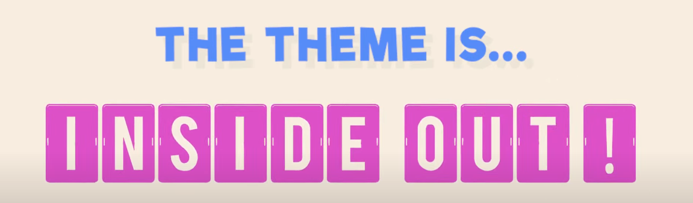

# Inside Out GameJam!

<!-- PROJECT LOGO -->
 

  
   
  

## How To Play
"Itch.io Link"

<!-- ABOUT THE PROJECT -->
## About The Project
[img]https://i.imgur.com/0QUoR9v.gif[/img]
This is a 2D Platformer in the theme of 'Inside Out' where the protaganist will eat food and turn it into solid block of excrement for the player to jump on.

## Built With

<!-- Developers & Artists -->
## Artists and Developers

[Luke Lavictoire - Artist](https://github.com/LukeLavictoire)
 
[Matt Arsenault - Developer](https://github.com/Arsenaultm90)
